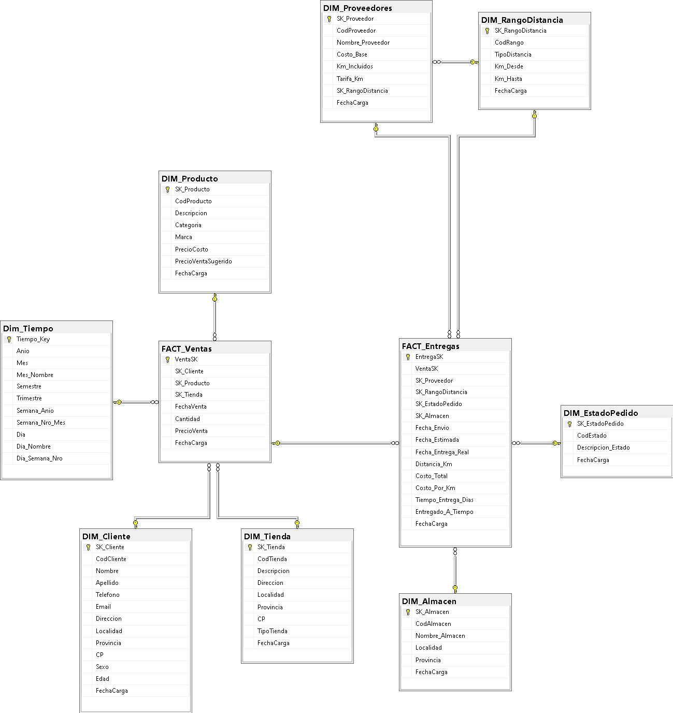
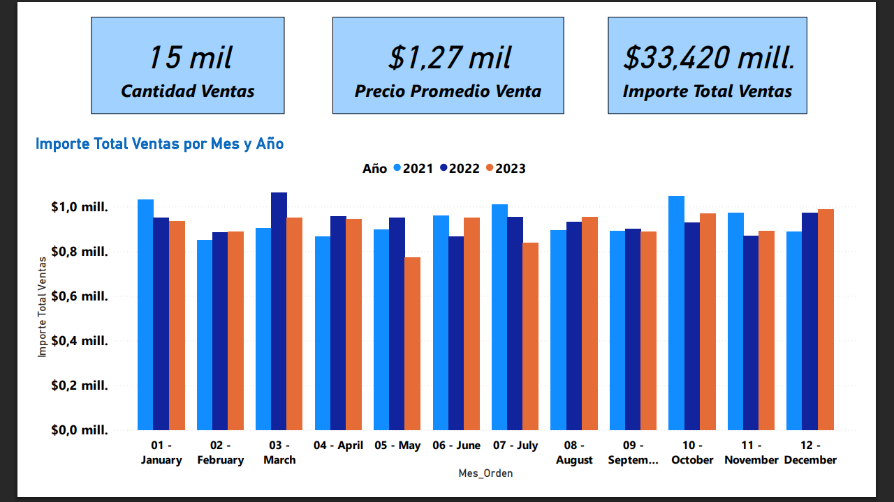
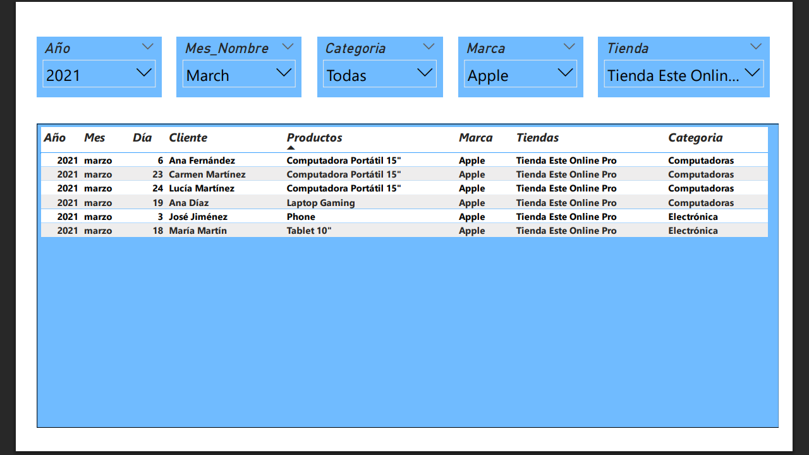
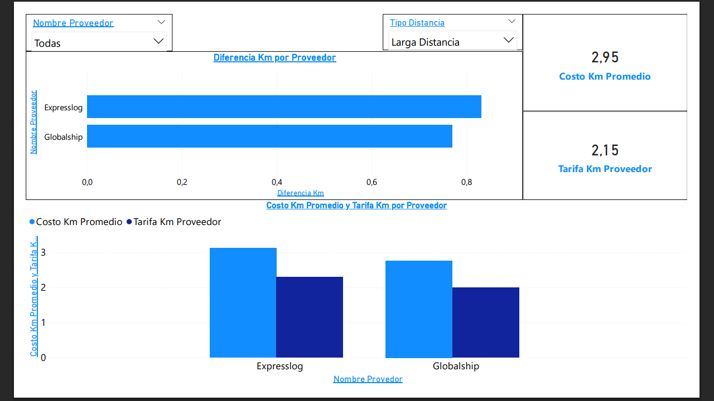
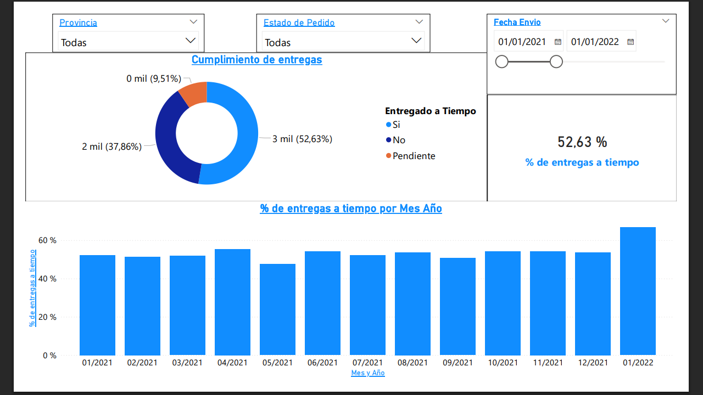

# 📊 DW_DataShop – Sistema de Inteligencia de Negocios y Analítica Logística

## 📌 Descripción del Proyecto
DW_DataShop es una solución integral de Business Intelligence basada en un Data Warehouse, diseñada para centralizar, procesar y analizar el ciclo comercial completo de una organización.

El proyecto evolucionó desde un análisis tradicional de ventas hacia un ecosistema analítico de 360°, integrando procesos logísticos para obtener visibilidad sobre la rentabilidad neta.

Permite auditar no solo los ingresos, sino también los costos operativos asociados a las entregas, mediante un modelo de datos robusto, escalable y orientado a la toma de decisiones.

---

## 🧱 Arquitectura del Sistema

El sistema se basa en una arquitectura de pipeline de datos de múltiples capas:

RAW → ETL → STG → ETL → INT → ETL → DW

### 🔹 Capas del Data Pipeline

- **RAW**: Ingesta de archivos CSV originales (ventas, entregas, productos, etc.)
- **STG (Staging)**: Limpieza y estandarización de datos utilizando Pandas y NumPy
- **INT (Integración)**:
  - Generación de datos simulados (15,000 registros – 3 años)
  - Aplicación de reglas de negocio (RN)
- **DW (Data Warehouse)**:
  - Implementado en SQL Server
  - Esquema Snowflake
  - Uso de Stored Procedures y SQLAlchemy
  - Gestión de claves sustitutas (SK) y dimensiones lentamente cambiantes

---

## 🔄 Procesos ETL

### ETL 1 (RAW → STG)
- Validación de estructura
- Normalización de cabeceras
- Detección de errores de formato

### ETL 2 (STG → INT)
- Limpieza avanzada de datos
- Generación de datos enriquecidos
- Aplicación de reglas probabilísticas y de negocio

### ETL 3 (INT → DW)
- Carga final al Data Warehouse
- Asignación de claves sustitutas (SK)
- Integración de dimensiones y hechos

---

## 🧠 Reglas de Negocio Implementadas

- **RN-01 – Ciclo de Entrega**  
  Diferencia entre fecha de envío y fecha de entrega real.

- **RN-02 – Costo Total de Entrega**  
  CostoBase + (TarifaKm × excedente de distancia).

- **RN-03 – On-Time Delivery (OTD)**  
  Clasificación de entregas en tiempo o demoradas.

- **RN-04 – Rango de Distancia**  
  Segmentación en urbano, regional y larga distancia.

- **RN-05 – Costo por Kilómetro**  
  Métrica de eficiencia logística por proveedor.

---

## 🧩 Modelo de Datos

El Data Warehouse se implementa bajo un **esquema Snowflake**, optimizado para reducir redundancia y permitir análisis complejos.

### 📊 Diagrama del Modelo

---

## 📊 Estructura del Data Warehouse

### 🔹 Tablas de Hechos
- `FACT_Ventas`
- `FACT_Entregas`

### 🔹 Dimensiones principales
- Cliente
- Producto
- Tienda
- Tiempo
- Almacenes
- Estado del Pedido
- Proveedores
- Rango de Distancia

---

## 📈 Visualización en Power BI

Se desarrollaron dashboards interactivos conectados al Data Warehouse para el análisis de ventas y logística.
Algunos de ellos son:

---

### 💰 Módulo de Ventas

#### 📊 KPIs y resumen de ventas

#### 📋 Tabla de detalle de ventas

Incluye:
- KPIs de ventas
- Análisis por cliente y tienda
- Segmentación por categoría y marca
- Exploración detallada con filtros dinámicos

---

### 📦 Módulo Logístico (Entregas)

#### 💸 Análisis de costos por proveedor

#### ✅ Cumplimiento de entregas (OTD)

Incluye:
- Evaluación de proveedores
- Eficiencia de almacenes
- Cumplimiento de plazos
- Relación entre distancia y costo
- Optimización de costos logísticos

---

## 📊 KPIs Clave

- % Entregas a tiempo (OTD)
- Tiempo promedio de entrega
- Costo total de entrega
- Costo por kilómetro
- Volumen de ventas
- Rentabilidad operativa

---

## 🛠 Tecnologías utilizadas

- Python (Pandas, NumPy)
- SQL Server
- SQLAlchemy
- Power BI
- Modelado dimensional (Snowflake)

---

## 🚀 Valor del Proyecto

Este sistema permite:

- Integrar ventas y logística en un único modelo analítico
- Analizar la rentabilidad considerando costos operativos
- Evaluar el desempeño de proveedores
- Detectar ineficiencias logísticas
- Tomar decisiones basadas en datos

---

## 👨‍💻 Autor

**Exequiel Manzanelli**  
Técnico Superior en Análisis de Sistemas